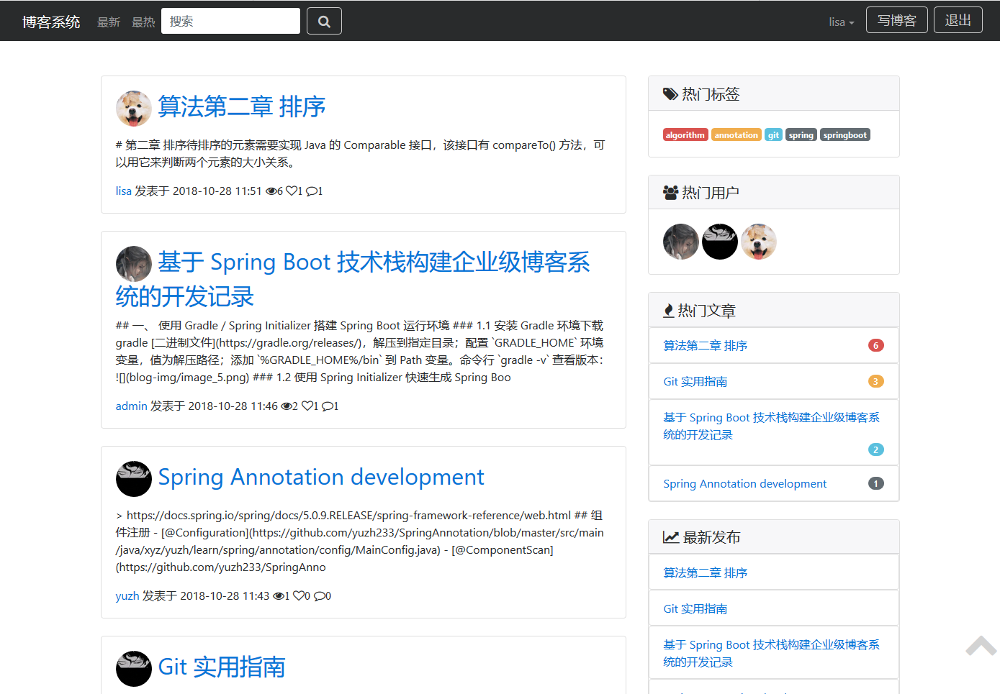

> **基于 Spring Boot 技术栈构建企业级博客系统的开发记录**</br>- 该项目构建基于 Gradle，目的在于通过博客系统的开发了解企业级开发的完整流程，学习掌握 Spring Boot 及其周边前沿技术。</br>- preview：http://blog.yuzh.xyz

|前端||
|--------------------|--------------------|
|BootStrap|样式框架|
|Thymeleaf| 模板引擎 |
|JQuery| js 函数库 |
|HTML5| 页面结构|
|JavaScript| 脚本|
|CSS|样式|

|后端||
|--------------------|--------------------|
|Spring|解耦合|
|Spring MVC| 控制层框架 |
|Spring Boot| 快捷开发，整合 Spring 全家桶 |
|Spring Data| 持久层框架，简化数据库操作 |
|Spring Security| 安全权限控制 |
|Hibernate| 遵循 JPA 规范的持久层实现 |


|数据存储||
|--------------------|--------------------|
|MySql| 关系型数据库 |
|H2| 内存数据库 |
|MongoDB| 文件存储|

|其他||
|--------------------|--------------------|
|Elastic Search| 全文检索 |
|Gradle| 项目构建 |

|插件||
|--------------------|--------------------|
|catalog-generator.js|博客目录生成插件|
|tether.js|下拉框插件|
|thinker-md.vendor.js|markdown 编辑器|
|toastr.min.js|提示框|
|cropbox.js|图片裁剪|
|...|...|

<!-- TOC -->

- [一、 使用 Gradle / Spring Initializer 搭建 Spring Boot 运行环境](#一-使用-gradle--spring-initializer-搭建-spring-boot-运行环境)
    - [1.1 安装 Gradle 环境](#11-安装-gradle-环境)
    - [1.2 使用 Spring Initializer 快速生成 Spring Boot 应用](#12-使用-spring-initializer-快速生成-spring-boot-应用)
    - [1.3 项目结构](#13-项目结构)
    - [1.4 自定义存储仓库](#14-自定义存储仓库)
    - [1.5 编写程序代码及测试用例](#15-编写程序代码及测试用例)
    - [1.6 以 Gradle / Wrapper 编译项目](#16-以-gradle--wrapper-编译项目)
    - [1.7 Gradle 项目运行的三种方式](#17-gradle-项目运行的三种方式)
- [二、 Thymeleaf 模板引擎](#二-thymeleaf-模板引擎)
    - [2.1 Thymeleaf](#21-thymeleaf)
    - [2.2 标准方言（语法）](#22-标准方言语法)
    - [2.3 表达式基本对象](#23-表达式基本对象)
    - [2.4 集成 Spring Boot](#24-集成-spring-boot)
    - [2.5 Thymeleaf 实战](#25-thymeleaf-实战)
- [三、 Spring Data JPA 数据持久化](#三-spring-data-jpa-数据持久化)
    - [3.1 JPA 简介](#31-jpa-简介)
    - [3.2 JPA 核心概念](#32-jpa-核心概念)
    - [3.3 Spring Data JPA 使用概括](#33-spring-data-jpa-使用概括)
    - [3.4. Spring Data JPA / Hibernate / Spring Boot 集成](#34-spring-data-jpa--hibernate--spring-boot-集成)
    - [3.5 数据持久化实战](#35-数据持久化实战)
        - [3.5.1 H2 内存数据库](#351-h2-内存数据库)
        - [3.5.2 MySql 物理数据库](#352-mysql-物理数据库)
- [四、Elastic Search 全文搜索](#四elastic-search-全文搜索)
    - [4.1 集成 Spring Boot](#41-集成-spring-boot)
- [五、集成 BootStrap](#五集成-bootstrap)
- [六、Spring Security 安全权限框架](#六spring-security-安全权限框架)
- [七、用户管理](#七用户管理)
- [八、角色权限管理](#八角色权限管理)
- [九、博客管理](#九博客管理)
- [十、评论管理](#十评论管理)
- [十一、点赞管理](#十一点赞管理)
- [十二、分类管理](#十二分类管理)
- [十三、标签管理](#十三标签管理)
- [十四、首页搜索](#十四首页搜索)
- [十五、部署相关](#十五部署相关)
    - [15.1 使用外部 MongoDB 存储文件服务器数据](#151-使用外部-mongodb-存储文件服务器数据)
    - [15.2 应用启动](#152-应用启动)

<!-- /TOC -->

## 一、 使用 Gradle / Spring Initializer 搭建 Spring Boot 运行环境

###  1.1 安装 Gradle 环境

下载 gradle [二进制文件](https://gradle.org/releases/)，解压到指定目录；

配置 `GRADLE_HOME` 环境变量，值为解压路径；

添加 `%GRADLE_HOME%/bin` 到 Path 变量。

命令行 `gradle -v` 查看版本：

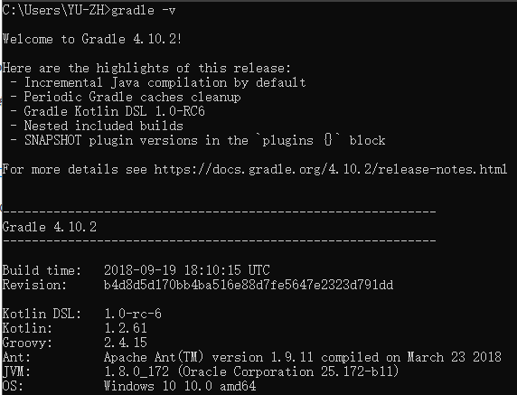

### 1.2 使用 Spring Initializer 快速生成 Spring Boot 应用

使用 Spring 快速开始[向导](https://start.spring.io/)，创建一个项目并下载到本地。  


使用 gradle 编译项目，进入根目录执行：

```shell
gradle build
```

编译完成之后会在目录生成一个 build 文件夹，里面存放着编译后的文件以及安装的jar。

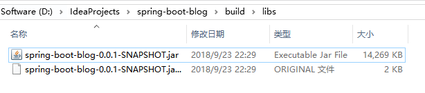

运行这个 jar ：

```shell
java -jar spring-boot-blog-0.0.1-SNAPSHOT.jar
```

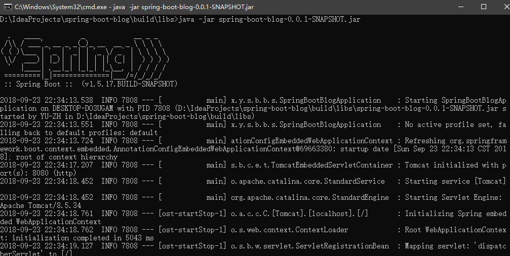

一个简单的 spring  boot 应用启动起来了，接下来可以正常访问。

### 1.3 项目结构

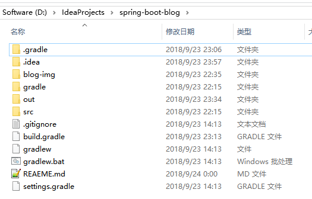

- `.gradle`  gradle 运行时相关配置文件，不用多说了。
- `文件夹 build` 项目编译后路径
- `文件夹 gradle` 
  - `文件夹 wrapper` 统一管理 gradle 版本，优点是即使没有装 gradle 环境可以运行里面的 jar 直接构建项目。
- `build.gradle` gradle的用户配置文件（构建脚本），相当于 maven 的 pom.xml.
- `gradlew` gradle 环境搭建的脚本（linux）
- `gradlew.bat` gradle 环境搭建的脚本（windows）
- `settings.gradle` 其他用户配置

### 1.4 自定义存储仓库

更改 build.gradle 配置文件：

```xml
// buildscript 代码块中脚本优先执行
buildscript {

    // ext 用于定义动态属性
    ext {
        springBootVersion = '1.5.17.BUILD-SNAPSHOT'
    }

    // 使用了 Maven 的中央仓库（也可以指定其他仓库）
    repositories {
        mavenCentral()
        maven { url "https://repo.spring.io/snapshot" }
        maven { url "https://repo.spring.io/milestone" }
        // 使用 aliyun 镜像仓库
//        maven { url 'http://maven.aliyun.com/nexus/content/groups/public/' }
    }

    // 依赖关系
    dependencies {
        // classpath 声明说明了在执行其余的脚本时，ClassLoader 可以使用这些依赖项
        classpath("org.springframework.boot:spring-boot-gradle-plugin:${springBootVersion}")
    }
}

// 使用插件
apply plugin: 'java'
apply plugin: 'eclipse'
apply plugin: 'org.springframework.boot'

group = 'xyz.yuzh.spring.boot.blog'

// 打包的类型为 jar，并指定了生成的打包的文件名称和版本
jar {
    baseName = 'hello-world'
    version = '0.0.1-SNAPSHOT'
}

version = '0.0.1-SNAPSHOT'
// 指定编译 .java 文件的 JDK 版本
sourceCompatibility = 1.8

// 默认使用了 Maven 的中央仓库。
repositories {
    mavenCentral()
    maven { url "https://repo.spring.io/snapshot" }
    maven { url "https://repo.spring.io/milestone" }
//    maven { url 'http://maven.aliyun.com/nexus/content/groups/public/' }
}

// 依赖关系
dependencies {
    // 该依赖对于编译发行是必须的
    compile('org.springframework.boot:spring-boot-starter-web')
    // 该依赖对于编译测试是必须的，默认包含编译产品依赖和编译时依
    testCompile('org.springframework.boot:spring-boot-starter-test')
}

```

### 1.5 编写程序代码及测试用例

控制层：

```java
@RestController
public class HelloController {
    @RequestMapping(value = "/hello")
    public String hello(){
        return "hello gradle!";
    }
}
```

用例代码：使用了 Spring Mvc 单元测试类 MockMVC，[详解参考](https://blog.csdn.net/kqzhu/article/details/78836275)

```java
@RunWith(SpringRunner.class)
@SpringBootTest
@AutoConfigureMockMvc
public class SpringBootBlogApplicationTests {
    @Autowired
    private MockMvc mockMvc;

    @Test
    public void testHello() throws Exception {
        ResultActions actions = mockMvc.perform(MockMvcRequestBuilders.get("/hello").
                accept(MediaType.APPLICATION_JSON)); // 指定客户端能够接收的内容类型

        actions.andExpect(status().isOk()); // 添加断言, 添加ResultMatcher验证规则，验证控制器执行完成后结果是否正确.
        actions.andExpect(content().string(equalTo("hello gradle!"))); // 添加断言,返回结果内容是否是指定的.
        actions.andDo(MockMvcResultHandlers.print()); // 添加一个结果处理器，输出整个响应结果信息.
        actions.andReturn(); // 执行完毕返回相应的结果
    }
}
```

### 1.6 以 Gradle / Wrapper 编译项目

当本地没有装 gradle 环境时，可以通过 wrapper 构建项目，只需在根目录执行即可打包：

```shell
gradlew build
```

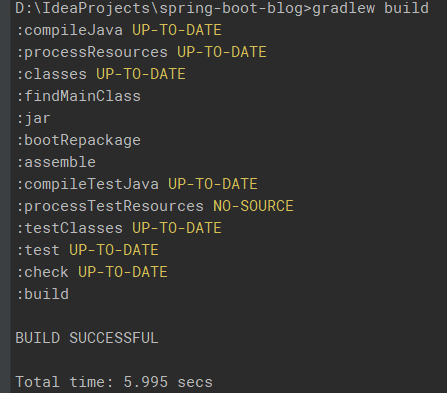

运行：

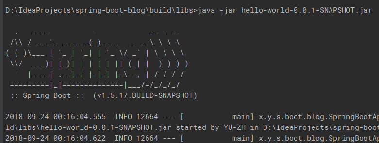

### 1.7 Gradle 项目运行的三种方式

1). 使用 java  -jar 

2). 通过 SpringApplication.run()

3). 使用 Spring Boot Gradle 插件

```shell
gradle bootRun / gradlew bootRun (wrapper 方式)
```

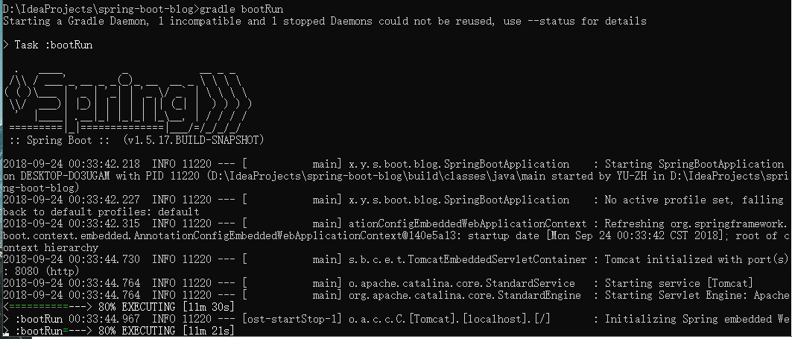

## 二、 Thymeleaf 模板引擎

### 2.1 Thymeleaf

[官方文档](https://www.thymeleaf.org/doc/tutorials/3.0/usingthymeleaf.html#introducing-thymeleaf)

Java 模板引擎。能够处理 Html / XML / JavaScript / CSS / 甚至纯文本 。类似于 JSP / FreeMarker

自然模板。原型即页面

语法优雅易懂。支持 OGNL / SpringEL

遵从 Web 标准。支持 HTML5

### 2.2 标准方言（语法）

**名称空间**

    <span th:text="…">
    需要引入命名空间:
    <html xmlns:th="http://www.thymeleaf.org">


或

    <span data-th-text="…">
    符合html5标准，不需要引入命名空间

**变量表达式 - ${…}**


	<span th:text="${book.author.name}">

**消息表达式（i8n / 国际化）- #{…}**

    <th th:text="#{header.address.city}">…</th>
    <th th:text="#{header.address.country}">…</th>

**选择表达式 - `*{…}`**

    <div th:object="${book}">
        ...
        <span th:text="*{title}">...</span>
        ...
    </div>

与变量表达式的区别：它是在当前选择的对象而不是整个上下文变量映射上执行。`${book}`  取的是整个上下文中的变量，而 `*{title}` 是在当前 `${book}`  里边的变量。因此变量表达式一定程度上提高了效率。

**链接表达式 - @{…}**

链接表达式可以是相对的，在这种情况下，应用程序上下文将不会作为 URL 的前缀

	<a th:href="@{../documents/report}">…</a>

也可以是服务器相对的，同样也没有应用程序上下文前缀

	<a th:href="@{~/contents/main}">…</a>

协议相对的（类似绝对 URL，但浏览器将使用在显示的页面中使用的相同的 HTTP 或 HTTPS 协议）

	<a th:href="@{//static.mycompany.com/res/initial}">…</a>

也可以是绝对的

	<a th:href="@{http://static.mycompany.com/main}">…</a>

**模板布局**

`th:insert` 将公共片段整个插入到声明引入的元素中

`th:replace` 将声明引入的元素替换为公共片段

`th:include` 将被引入的片段的内容包含进这个标签


    <footer th:fragment="copy">
    	&copy; 2011 The Good Thymes Virtual Grocery
    </footer>
    
    引入方式
    <div th:insert="footer :: copy"></div>
    <div th:replace="footer :: copy"></div>
    <div th:include="footer :: copy"></div>
    
    效果
    <div>
        <footer>
        	&copy; 2011 The Good Thymes Virtual Grocery
        </footer>
    </div>
    
    <footer>
    	&copy; 2011 The Good Thymes Virtual Grocery
    </footer>
    
    <div>
    	&copy; 2011 The Good Thymes Virtual Grocery
    </div>
也可以使用指定的 id 来替代 `th:fragment="copy"` 引用时指定 `#id`

**字面量**

文本 `<span th:text="'web application'">` 单引号包裹

数字 `<span th:text="2015"> or <span th:text="2980 + 3">`

布尔：`<span th:if="${user.isAdmin()} == false">` or  `<span th:if="${user.name} == null`

算术操作 (+ 、-、*、/、%)：`<span th:with="isEven=(${prodStat.count} % 2 == 0)">`

比较和等价：`> 、< 、>= 、 <= （gt、lt、ge、le）`

等价： `== 、 != (eq、ne)`

**条件运算**

    <span th:class="${row.even} ? ‘even' : ‘odd' "></span>

**无操作 - __**

    <span th:text="${user.name} ? : __">no user authenticated</span>

用户名不存在取无操作运算符，保留原始文本值。

**设置属性值**

设置任意属性值 `th:attr`

	th:attr="action=@{/subsctibe}" 设置action属性值

设置指定属性值，比如:  `th:action / th:value  / th:text`

固定布尔属性， `th:checked="${user.active}"` 如果结果为 true 设置为选中状态

**迭代器**

基本迭代 th:each

    <li th:each=“book : ${books}” th:text=“${book.title}”>En las Orillas del Sar</li>

状态变量：`index（0开始）、count（1开始）、size、current、even/odd、first、last`

**条件语句**

th:if / th:unless （成立时 / 不成立时）

th:switch

    <div th:switch="${user.role}">
    	<p th:case="'admin'">user is an administrator</p>
    	<p th:case="${roles.manager}">user is an manager</p>
    	<p th:case="*">user is some other thing</p>
    </div>

**注释**

1). 标准的 html 注释 `<!-- -->`

2). thymeleaf 解析器注释块 `<!--/*  */-->`

    删除 <!--/* 和 */--> 之间的所有内容

    <!--/*--> 
      <div>you can see me only before thymeleaf processes me!</div>
    <!--*/-->

3). 原型注释块：当模板静态打开时（比如原型设计），原型注释块所注释的代码将被注释，而在模板执行时，这些注释的代码，会被显示出来。

原型设计代码：

    <span>hello</span>
    <!--/*/ 
        <div th:th:text="${...}">
            ...
        </div>
    /*/-->
    <span>goodbye!</span>

模板渲染执行后：

    <span>hello</span>
    	<div th:th:text="${...}">
    		...
    	</div>
    <span>goodbye!</span>
**内联表达式**

[[…]] 或 [(…)] 分别对应于 th:text（会转译特殊字符） 和 th:utext（不会转译特殊字符）

禁用内联：`th:inline="none"`

Javascript 内联：`th:inline="JavaScript"`

CSS 内联：`th:inline="css"`

### 2.3 表达式基本对象

`#ctx`：上下文对象。是 `org.thymeleaf.context.IContext` 或者 `org.thymeleaf.context.IWebContext` 的实现。

`#locale`： 直接访问与 `java.util.Locale` 关联的当前的请求。

    ${#ctx.locale}
    ${#ctx.bariableNames}
    
    ${#ctx.request}
    ${#ctx.response}
    ${#ctx.session}
    ${#ctx.servletContext}
    
    ${#locale}

**Request/session 等属性**

param：用于检索请求参数

session：用于检索session属性

application：用于检索application/servlet上下文属性

	${#param.foo}
	${#param.size()}
	${#param.isEmpty()}
	${#param.containsKey('foo')}
	
	${#session.foo}
	${#session.size()}
	${#session.isEmpty()}
	${#session.containsKey('foo')}
	
	${#application.foo}
	${#application.size()}
	${#application.isEmpty()}
	${#application.containsKey('foo')}

**Web上下文对象**

`#request`：直接访问与当前请求关联的 HttpServletRequest 对象

`#session`：直接访问与当前请求关联的 HttpSession 对象

`#servletContext`：直接访问与当前请求关联的 servletContext 对象

	${#request.getAttribute('foo')}
	${#request.getParameter('foo')}
	${#request.getContextPath()}
	${#request.getRequestName())}
	
	${#session.getAttribute('foo')}
	${#session.id}
	${#session.lastAccessedTime}
	
	${#servletContext.getAttribute('foo')}
	${#servletContext.contextPath}
### 2.4 集成 Spring Boot

修改 buid.gradle。添加对 Thymeleaf 的依赖，自定义 Thymeleaf 和 Thyme leaf Layout Dialect 的版本。

```xml
buildscript {
    // ext 用于定义动态属性（统一管理版本）
    ext {
        springBootVersion = '1.5.17.BUILD-SNAPSHOT'
    }

    // 指定 Thymeleaf 和 Thymeleaf Layout Dialect 的版本
    ext['thymeleaf.version'] = '3.0.3.RELEASE'
    ext['thymeleaf-layout-dialect.version'] = '2.2.0'
    ......
}
......
// 依赖关系
dependencies {
   ......
    // 添加 Thymeleaf 依赖
    testCompile('org.springframework.boot:spring-boot-starter-thymeleaf')
}
```

修改 Spring Boot 的 application.properties（或 application.yml ）

```yml
spring:
  thymeleaf:
    encoding: UTF-8
    cache: false
    # 使用 HTML5 标准
    mode: HTML5
```

### 2.5 Thymeleaf 实战

**接口设计**

| 接口                     | 描述                                   |
| ---------------------- | ------------------------------------ |
| GET /users             | 返回用于展示用户列表的 list.html                |
| GET /users/{id}        | 返回用于展示用户的 view.html                  |
| GET /users/form        | 返回用于新增或者修改用户的 form.html              |
| POST /users            | 新增或修改用户，成功后重定向到 list.html            |
| GET /users/delete/{id} | 根据 id 删除相应的用户数据，成功后重定向到 list.html    |
| GET /users/modify/{id} | 根据 id 获取相应的用户数据，并返回 form.html 用来执行修改 |

**后台编码**

```java
@Repository
public class UserRepositoryImpl implements UserRepository {
    /**
     * 累加器
     */
    private static AtomicLong counter = new AtomicLong();

    /**
     * 暂存数据
     */
    ConcurrentMap<Long, User> userMap = new ConcurrentHashMap<>();

    @Override
    public User saveOrUpdateUser(User user) {
        Long id = user.getId();
        if (id <= 0) {
            id = counter.incrementAndGet();
            user.setId(id);
        }
        userMap.put(id, user);
        return null;
    }

    @Override
    public void deleteUser(Long id) {
        userMap.remove(id);
    }

    @Override
    public User getUserById(Long id) {
        return userMap.get(id);
    }

    @Override
    public List<User> listUser() {
        return new ArrayList<>(userMap.values());
    }
}
```

```java
@RestController
@RequestMapping(value = "/users")
public class UserController {

    @Autowired
    private UserRepository userRepository;

    public List<User> getUserList() {
        return userRepository.listUser();
    }

    /**
     * 查询所有用户 [ GET /users ]
     *
     */
    @GetMapping
    public ModelAndView list(ModelMap map) {
        map.addAttribute("users", getUserList());
        map.addAttribute("title", "用户管理");
        return new ModelAndView("users/list", "userModel", map);
    }

    /**
     * 根据 id 查询用户 [ GET /users/{id} ]
     */
    @GetMapping(value = "/{id}")
    public ModelAndView getUserById(@PathVariable("id") Long id, ModelMap map) {
        User user = userRepository.getUserById(id);
        System.out.println(user);
        map.addAttribute("user", user);
        map.addAttribute("title", "查看用户");
        return new ModelAndView("users/view", "userModel", map);
    }

    /**
     * 跳转到新建用户 [ GET /users/form ]
     */
    @GetMapping(value = "/form")
    public ModelAndView createForm(ModelMap map) {
        map.addAttribute("user", new User());
        map.addAttribute("title", "创建用户");
        return new ModelAndView("users/form", "userModel", map);
    }

    /**
     * 新建及修改 [ POST /users ]
     */
    @PostMapping
    public ModelAndView create(User user) {
        userRepository.saveOrUpdateUser(user);
        return new ModelAndView("redirect:/users");
    }

    /**
     * 删除用户 [ GET /users/delete/{id} ]
     */
    @GetMapping(value = "delete/{id}")
    public ModelAndView delete(@PathVariable("id") Long id, ModelMap map) {
        userRepository.deleteUser(id);
        map.addAttribute("users", getUserList());
        return new ModelAndView("redirect:/users");
    }

    /**
     * 跳转修改页面 [ GET /users/modify/{id} ]
     */
    @GetMapping(value = "modify/{id}")
    public ModelAndView update(@PathVariable("id") Long id, ModelMap map) {
        User user = userRepository.getUserById(id);
        map.addAttribute("user", user);
        map.addAttribute("title", "修改用户");
        return new ModelAndView("users/form", "userModel", map);
    }

}
```

**前台设计**

fragment/header.html：共用的头部页面

```html
<!DOCTYPE html>
<html lang="en" xmlns:th="http://www.thymeleaf.org" xmlns:layout="http://www.ultraq.net.nz/thymeleaf/layout">
<head>
    <meta charset="UTF-8">
    <title>Thymeleaf in action</title>
</head>
<body>
<div th:fragment="header">
    <h1>Thymeleaf in action</h1>
    <a th:href="@{~/users}">首页</a>
    <a th:href="@{~/users/form}">新增</a>
</div>
</body>
</html>
```

fragment/footer.html：共用的底部页面

```html
<div th:fragment="footer">
    <a th:href="@{http://blog.yuzh.xyz}">welcome to blog.yuzh.xyz</a>
</div>
```

users/form.html 新增/修改

```html
<!DOCTYPE html>
<html lang="en" xmlns:th="http://www.thymeleaf.org" xmlns:layout="http://www.ultraq.net.nz/thymeleaf/layout">
<head>
    <meta charset="UTF-8">
    <title>Thymeleaf in action</title>
</head>
<body>
<div th:replace="~{fragments/header::header}"></div>
<h3 th:text="${userModel.title}"></h3>
<form th:action="@{~/users}" method="post">
    <input type="text" name="name" th:value="${userModel!=null}?${userModel.user.name}" placeholder="name">
    <input type="email" name="email" th:value="${userModel!=null}?${userModel.user.email}" placeholder="email">
    <input type="text" name="age" th:value="${userModel!=null}?${userModel.user.age}" placeholder="age">
    <input type="submit" th:value="${userModel.title=='创建用户'} ? 'register' : 'modify'">
    <input type="hidden" name="id" th:if="${userModel.title=='修改用户'}" th:value="${userModel.user.id}">
</form>
<div th:replace="~{fragments/footer::footer}"></div>
</body>
</html>
```

users/list.html 列表展示

```html
<!DOCTYPE html>
<html lang="en" xmlns:th="http://www.thymeleaf.org" xmlns:layout="http://www.ultraq.net.nz/thymeleaf/layout">
<head>
    <meta charset="UTF-8">
    <title>Thymeleaf in action</title>
</head>
<body>
<div th:replace="~{fragments/header :: header}"></div>
<h3 th:text="${userModel!=null}?${userModel.title}">yuzh</h3>
<table border="1">
    <thead>
    <tr>
        <th>ID</th>
        <th>Email</th>
        <th>Name</th>
        <th>Age</th>
        <th>操作</th>
    </tr>
    </thead>
    <tbody>
    <tr th:if="${userModel.users.size()}==0">
        <td colspan="5">没有用户信息！</td>
    </tr>
    <tr th:each="user:${userModel.users}">
        <td th:text="${user.id}"></td>
        <td th:text="${user.email}"></td>
        <td th:text="${user.name}"></td>
        <td th:text="${user.age}"></td>
        <td>
            <a href="" th:href="@{~/users/}+${user.id}">修改</a>
            <a href="" th:href="@{~/users/delete/}+${user.id}">删除</a>
        </td>
    </tr>
    </tbody>
</table>
<div th:replace="~{fragments/footer::footer}"></div>
</body>
</html>
```

users/view 查看用户

```html
<!DOCTYPE html>
<html lang="en" xmlns:th="http://www.thymeleaf.org" xmlns:layout="http://www.ultraq.net.nz/thymeleaf/layout">
<head>
    <meta charset="UTF-8">
    <title>Thymeleaf in action</title>
</head>
<body>
<div th:replace="~{fragments/header :: header}"></div>
<h3>[[${userModel.title}]]</h3>
<a th:href="@{~/users/modify/}+${userModel.user.id}">修改信息</a>
<p>ID：[[${userModel.user.id}]]</p>
<p>Name：[[${userModel.user.name}]]</p>
<p>Email：[[${userModel.user.email}]]</p>
<p>Age：[[${userModel.user.age}]]</p>
<div th:replace="~{fragments/footer :: footer}"></div>
</body>
</html>
```

## 三、 Spring Data JPA 数据持久化

### 3.1 JPA 简介

JPA (Java Persistence API) 是用于管理 JavaEE 和 JavaSE环境中的持久化，以及对象/关系映射的 Java API。

JPA 是用于处理数据持久化的接口（规范），基于 JPA 规范的实现有 EclipiseLink、Hibernate、Apache OpenJPA

### 3.2 JPA 核心概念

理解 jpa 的核心概念，才能更好的使用 jpa 持久化。没有符合任意一项都不能成功完成持久化！

**实体**

- 实体表示关系型数据库中表
- 每个实体实例对应于表中的行
- 类必须使用 javax.persistence.Entity 注解
- 类必须有一个 public 或 protected 的无参数构造器
- 实体实例被当作以分离对象方式进行传递（例如通过会话 bean 的远程业务接口），则该类必须实现 Serializable 接口
- 必须要有唯一的对象标识符：简单主键（javax.persistence.Id）、复合主键（javax.persistence.Embeddedld 和 javax.persistence.IdClass）

**关系**

- 一对一：@OneToOne
- 一对多：@OneToMany
- 多对一：@ManyToOne
- 多对多：@ManyToMany

**EntityManager (管理实体的接口**

*管理实体的接口*

- 定义用于与持久化上下文进行交互的方法
- 创建和删除持久实体实例，通过实体的主键查找实体
- 允许在实体上运行查询

*获取 EntityManager 实例*

```java
@PersistenceUnit 
EntityManagerFactory emf; // 用于创建 EntityManager 的工厂类
EntityManager em;
@Resource
UserTransaction utx; // 事务
...
em = emf.createEmtityManager(); // 创建 EntityManager 
try{
    utx.begin(); // 事务开始
    em.persist(SomeEntity); // 通过实体管理器持久化一个实体对象
    em.merge(AnotherEntity); // 通过实体管理器合并一个实体对象
    em.remove(ThirdEntity); // 通过实体管理器移除一个实体对象
    utx.commit(); // 事务提交
} catch (Exception e){
    utx.rollback(); // 回滚
}
```

*查找实体*

```java
@PersistenceContext
EntityManager em;
public void enterOrder(int custID, CustomerOrder newOrder){
    Customer cust = em.find(Customer.class, custID); // 通过实体管理器查找指定类型的实体
    cust.getOrders().add(newOrder);
    newOrder.setCustomer(cust);
}
```

### 3.3 Spring Data JPA 使用概括

**什么是 Spring Data JPA：**

- Spring Data 家族的一部分
- 对基于 JPA 的数据访问层的增强支持
- 更容易构建基于使用 Spring 的数据访问技术栈的应用程序

**常用接口：**

- CrudRepository 定义了一些增删改查的通用接口
- PagingAndSortingRepository 用于分页和排序的接口，扩展于 CrudRepository

- 自定义接口：继承 Repository 及子类

### 3.4. Spring Data JPA / Hibernate / Spring Boot 集成

修改 build.gradle 

```gradle
buildscript {
	......
    // 自定义  Hibernate 的版本
    ext['hibernate.version'] = '5.2.8.Final'
    ......
}
// 依赖关系
dependencies {
	......
    // 添加 Spring Data JPA 的依赖
    compile('org.springframework.boot:spring-boot-starter-data-jpa')

    // 添加 MySQL连接驱动 的依赖
    compile('mysql:mysql-connector-java:6.0.5')
    
     // 添加 H2 的依赖 内存数据库
    runtime('com.h2database:h2:1.4.193')
	......
}
```

### 3.5 数据持久化实战

#### 3.5.1 H2 内存数据库

**后台编码**

- 实体 User
- 资源库 UserRepository
- 控制器 UserController

修改实体：实现 `Serializable` 接口、添加 `@Entity` 、设置主键 `@Id` 和自增策略 `@GeneratedValue`

```java
@Entity // 实体
public class User implements Serializable {

    @Id // 主键
    @GeneratedValue(strategy = GenerationType.IDENTITY) // 自增策略
    private long id;
    private String name;
    private String email;
    private int age;

    protected User() { // JPA 的规范要求无参构造函数；设为 protected 防止直接使用
    }

    public User(long id, String name, String email, int age) {
        this.id = id;
        this.name = name;
        this.email = email;
        this.age = age;
    }

    @Override
    public String toString() {
        return "User{" +
                "id=" + id +
                ", name='" + name + '\'' +
                ", email='" + email + '\'' +
                ", age=" + age +
                '}';
    }
}
```

修改资源库：删除自己的实现、继承 JPA 的 `@Repository` 接口

```java
/**
 * @author yu.zh [yuzh233@gmail.com] 2018/09/25 21:57
 * <p>
 * CrudRepository 提供了常用接口，自己无需编写接口。
 */
public interface UserRepository extends CrudRepository<User, Long> {
}
```

修改控制器：将自己的实现方法的调用改为 JPA 的常用 api，如：`findAll()` /  `findOne(id)` /  `save(user)` /  `delete(id)` 

**访问与验证数据**

能正常访问与操作，数据存储在了 `内存数据库 H2` ,使用 h2 的 `控制台` 访问数据。

设置显示 h2 控制台：

```yml
spring:
  # 使用 H2 控制台
  h2.console.enabled: true
```

访问控制台： http://localhost:8080/h2-console/

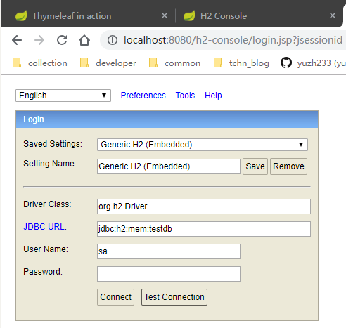

注意：JDBC URL 需要手动更改为 `jdbc:h2:mem:testdb` 才能正常访问，否则看不到保存的表。接着点击 `connect` 

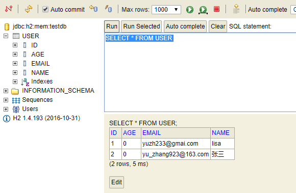


可以看到 JPA 在内存型数据中自动保存了一张 `USER` 表，就是 User 实体所映射的表，并且根据主键关系与实体属性映射了添加的数据，我们可以与使用关系型数据库一样的方式对内存型数据库执行 SQL 操作。

#### 3.5.2 MySql 物理数据库

修改配置文件：

```yml
spring:
  # 模板引擎
  thymeleaf:
    encoding: UTF-8
    cache: false
    mode: HTML5

  # 使用 H2 控制台
  h2.console.enabled: true

  # 数据源
  datasource:
    url: jdbc:mysql://localhost/blog?characterEncoding=utf-8&useSSL=false&serverTimezone=UTC
    username: root
    password: admin
    driver-class-name: com.mysql.cj.jdbc.Driver

  # JPA
  jpa:
    show-sql: true
    hibernate:
      # 每次启动都会删除之前的表结构和数据并重新生成新的表结构
      ddl-auto: create-drop
```

启动项目，可以看到 hibernate 自动创建了表结构，字段和实体属性一一对应。

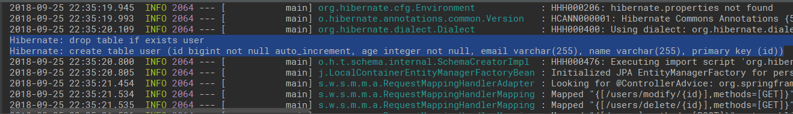

浏览器存入了两条数据之后，查看数据库：

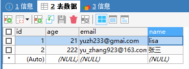

数据成功存入，并且 h2 数据库没有存入，说明指定了 mysql 作为数据源， h2 的配置可有可无了。

**在实际场景中使用 MySql 这种大型数据库，在开发测试过程中建议使用 H2 这种内存数据库，提高开发效率。**

## 四、Elastic Search 全文搜索

**概念**：全文搜索是一种将文件中所有文本与搜索项匹配的文字资料检索方法

**实现原理**：

- 建立文本库：搜索的数据源

- 建立索引：提取规律，以便快速查找。

- 执行搜索：用户请求

- 过滤结果：对搜索结果处理

**Elastic Search 是什么**：

- 高度可扩展的开源全文搜索和分析引擎

- 快速、近实时地对大数据进行存储、搜索和分析

- 用来支持又复杂的数据搜索需求的企业级应用

**Elastic Search 特点**：

- 分布式

- 高可用

- 多 API

- 面向文档

- 异步写入

- 近实时

- 基于 Lucene 搜索引擎

- 遵循 Apache 协议

**Elastic Search 核心概念**：

- 近实时：根据刷新策略定期刷新索引到索引库，在存入索引库和读取索引库数据效率之间折中。

- 集群：一个或多个的节点的集合，用于保存应用的全部数据并提供基于全部节点的集成式搜索功能。

- 节点：集群中的单台服务器，用来保存数据并参与集群保存和搜索数据的操作。

- 索引：用于加快搜索速度，在 ES 中，索引是相似文档的集合。

- 类型：对索引中包含文档的细分，区分不同类型的索引。

- 文档：进行索引的基本单位，与索引中的类型是相对应的。每一个具体的索引有一个文档与之对应，使用 json 格式表示。文档的实例就是对应关系型数据中的实体（具体的数据）。

- 分片：当索引超出单个节点所能承受的范围，可以使用分片来存储索引的部分数据，ES 会自动处理索引的分片与聚合。

- 副本：分片的副本，有利于提高搜索效率和吞吐量。默认 ES 为每个索引分配 5 个分片和一个副本。

### 4.1 集成 Spring Boot
环境：

- Elastic Search 2.4.4

- Spring Data Elastic Search 2.1.4.RELEASE -- Spring Boot 对 ES 的支持模块

- JNA 4.3.0 -- ES 依赖模块

依赖：

```gradle
dependencies {
    // 添加  Spring Data Elasticsearch 的依赖
    compile('org.springframework.boot:spring-boot-starter-data-elasticsearch')
    // 添加  JNA 的依赖
    compile('net.java.dev.jna:jna:4.3.0')
}

```

配置：

```yml
spring:
  data:
    elasticsearch:
      # 服务地址
      cluster-nodes: localhost:9300

      # 连接超时时间
      properties:
        transport:
          tcp:
            connect_timeout：120
```
开启 Elastic Search：

- 下载二进制文件：[官网](https://www.elastic.co/cn/downloads/elasticsearch)

- 解压到指定目录

- 进入 bin，根据系统平台执行 elasticsearch 命令

后台编码：

- 索引库实体：EsBlog

- 资源库：EsBlogRepository

- 测试用例：EsBlogRepositoryTest

- 控制器：BlogController

文档库实体：
```java
@Document(indexName = "blog", type = "blog") // 标注为文档实体类
public class EsBlog implements Serializable {

    @Id
    private String id;
    private String title;
    private String summary; // 关键字
    private String content;

    // 遵循 JPA 规范
    protected EsBlog() {
    }

    ......
}
```
资源库：
```java
public interface EsBlogRepository extends ElasticsearchRepository<EsBlog, String> {

    /**
     * 分页查询博客（去重）
     * JPA 自动根据方法名执行查询
     */
    Page<EsBlog> findDistinctEsBlogByTitleContainingOrSummaryContainingOrContentContaining(
        String title,
        String summary,
        String content,
        Pageable pageable);
}
```
测试用例：
```java
@RunWith(SpringRunner.class)
@SpringBootTest
public class TestEsBlogRepository {
    @Autowired
    private EsBlogRepository esBlogRepository;

    /**
     * 测试文档库之前存入数据
     */
    @Before
    public void initEsBlogRepository() {
        esBlogRepository.deleteAll();
        esBlogRepository.save(new EsBlog("登鹤雀楼", "王之涣的登鹤雀楼",
                "白日依山尽，黄河入海流。欲穷千里目，更上一层楼。"));
        esBlogRepository.save(new EsBlog("相思", "王维的相思",
                "红豆生南国，春来发几枝。愿君多采颉，此物最相思。"));
        esBlogRepository.save(new EsBlog("静夜思", "李白的静夜思",
                "床前明月光，疑是地上霜。举头望明月，低头思故乡。"));
    }

    @Test
    public void testFindDistinctEsBlogByTitleContainingOrSummaryContainingOrContentContaining() {
        Pageable pageRequest = new PageRequest(0, 20);
        // 搜索条件
        String title = "思";
        String summary = "思";
        String content = "相思";
        Page<EsBlog> page = esBlogRepository.findDistinctEsBlogByTitleContainingOrSummaryContainingOrContentContaining(
                title, summary, content, pageRequest);
        // 断言根据指定的 title、summary、content 来搜索 记录有两条
        assertThat(page.getTotalElements()).isEqualTo(2);

        // 打印结果
        for (EsBlog blog : page.getContent()){
            System.out.println(blog);
        }
    }
}
```
控制器：
```java
@RestController
@RequestMapping("/")
public class BlogController {

    @Autowired
    private EsBlogRepository esBlogRepository;

    @RequestMapping(value = "/blogs")
    public List<EsBlog> list(@RequestParam(value = "title") String title,
                             @RequestParam(value = "summary") String summary,
                             @RequestParam(value = "content") String content,
                             @RequestParam(value = "pageIndex", defaultValue = "0") int pageIndex,
                             @RequestParam(value = "pageSize", defaultValue = "10") int pageSize
    ) {
        Pageable pageable = new PageRequest(0, 10);
        Page<EsBlog> page = esBlogRepository.findDistinctEsBlogByTitleContainingOrSummaryContainingOrContentContaining(
                title, summary, content, pageable);

        return page.getContent();
    }
}
```
访问：

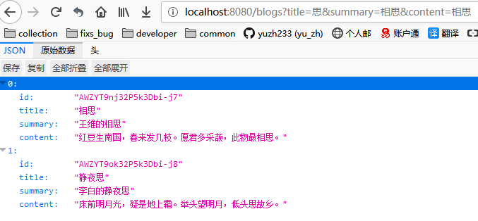

## 五、集成 BootStrap

**是什么**：

- 基于 HTML、CSS、JavaScript

- 响应式布局

- 移动设备优先

**如何实现**：

- 文档必须是 HTML5

- 设置响应式的 meta 标签

        <meta bane="viewport" content="width=device-width, initial-scale=1, shrink-to-fit=no">

- 通过 Normalize.css 达到浏览器一致性适配

    - 使用 Normalize 建立跨浏览器的一致性

    - 额外支持的 Reboot 

**核心概念**：

移动设备优先策略

- 基础的 CSS 是移动优先。优先设计更小的宽度

- 媒体查询。针对平板电脑、台式电脑再做宽屏适配

- 渐进增强。随着屏幕大小的增加而添加元素

网格系统

响应式：viewport 尺寸的增加，系统会自动分为最多 12 格：

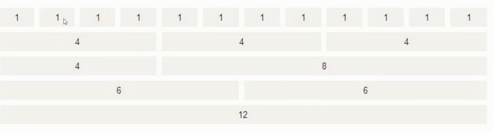

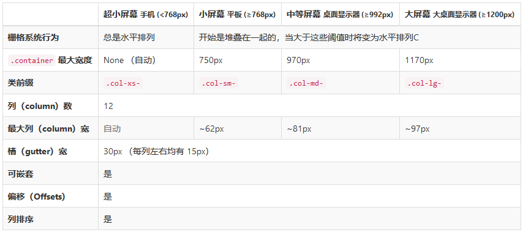

实例：
```html
<!-- 此为一行，该行中有两列 -->
<div class="row">
    <!-- 此为一列：移动设备下占满 12 格，中型PC下占 8 格 -->
    <div class="col-xs-12 col-md-8">.col-xs-12 col-md-8 .col-xs-12 col-md-8</div>
    <div class="col-xs-6 col-md-4">.col-xs-6 .col-md-4</div>
</div>

<!-- 一行中有三列 -->
<div class="row">
    <!-- 三列各占网格的 4 格刚好占满一行 -->
    <div class="col-xs-6 col-md-4">.col-xs-6 .col-md-4</div>
    <div class="col-xs-6 col-md-4">.col-xs-6 .col-md-4</div>
    <div class="col-xs-6 col-md-4">.col-xs-6 .col-md-4</div>
</div>

<!-- 一行中有两列 -->
<div class="row">
    <!-- 该行中有两列，每列占 6 格刚好占满一行 -->
    <div class="col-xs-6">.col-xs-6</div>
    <div class="col-xs-6">.col-xs-6</div>
</div>
<!--  -->
```
效果：

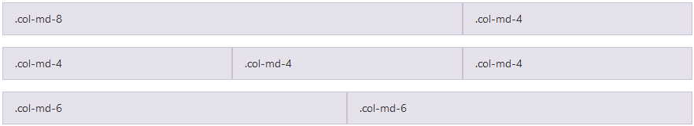

**常用组件、样式**

- Typography 处理印刷

- Table

- Form

- Button

- Dropdown 下拉框

- ButtonGroup 

- InputGroup

- Bavbar

- Pagination 分页

- Tag

- Alert 提示框

- Modal Dialog 模态框

- Progress Bar 进度条

- List Group 列表

- Card 卡片

- Tooltip 提示

## 六、Spring Security 安全权限框架

**角色**

- 代表一系列行为或责任的实体

- 限定能做什么、不能做什么

- 用户账号往往与角色相关联

**RBAC**

- 基于角色的访问控制（Role-Base Access Control）

- 隐式访问控制：与角色关联的访问控制

- 显式访问控制：与权限关联的访问控制（更灵活）

**安全领域核心概念**

- 认证（authentication）：“认证”是建立主体（principal）的过程。“主体”通常是指可以在您的应用程序中执行操作的用户、设备或其他系统。

- 授权（authorization）：或称为：“访问控制（access-control）”，“授权”是指决定是否允许主体在应用程序中执行操作。

**支持的身份验证功能**

- HTTP BASIC

- HTTP Digest

- HTTP X.509

- LDAP

- 基于表单的认证

- OpenID

- 单点登陆

- Remmenber-Me

- 匿名身份验证

- Run-ad

- JAAS

- JavaEE 容器认证

**提供的模块**

- Core - Spring-security-core.jar —— 核心模块

- Remoting - spring-security-remoting.jar —— 与 Spring Remoting 整合包

- Web - spring-security-web.jar —— web 支持

- Config - spring-security-config.jar —— 安全配置

- LDAP - spring-security-idap.jar —— 用于 LDAP 认证及配置

- ACL - spring-secutiry-acl.jar —— 访问控制列表的实现，对特定对象的实例进行安全配置

- CAS - spring-secutiry-cas.jar —— 可作为单点登陆服务器

- OpenID - spring-secutiry-openid.jar

- Test - spring-secutiry-test.jar

**与 Spring Boot 集成**

环境：

- Spring Secutiry 4.2.2.RELEASE

- Thymeleaf Spring Secutiry 3.0.2.RELEASE

依赖：

```gradle
dependencies {
    // 添加  Spring Security 依赖
    compile('org.springframework.boot:spring-boot-starter-security')
    // 添加   Thymeleaf Spring Security 依赖，与 Thymeleaf 版本一致都是 3.x
    compile('org.thymeleaf.extras:thymeleaf-extras-springsecurity4:3.0.2.RELEASE')
}
```

后台编码：

- 安全配置类

- 控制器

前台编码：

- index.html

- header.html

- login.html

```java
@EnableWebSecurity
public class SpringSecurityConfig extends WebSecurityConfigurerAdapter {

    /**
     * 自定义配置
     */
    @Override
    protected void configure(HttpSecurity http) throws Exception {
        http
                .authorizeRequests()
                    .antMatchers("/css/**", "/js/**", "/fonts/**", "/index").permitAll() // 都可以访问
                    .antMatchers("/users/**").hasRole("ADMIN") // 需要相应的角色才能访问
                    .and()
                .formLogin()   // 基于 Form 表单登录验证
                    .loginPage("/login") // 跳转到登陆地址
                    .failureUrl("/login-error"); // 登陆失败跳转地址
    }

    /**
     * 认证信息管理
     *
     * @param auth
     * @throws Exception
     */
    @Autowired
    public void configureGlobal(AuthenticationManagerBuilder auth) throws Exception {
        auth.inMemoryAuthentication() // 认证信息存储内存中
                .withUser("yuzh").password("admin").roles("ADMIN"); // 硬编码测试
    }
}
```

## 七、用户管理

**需求/核心功能**

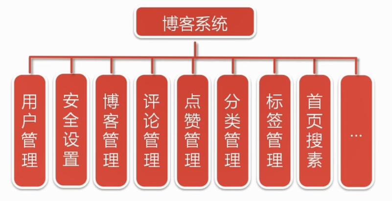

**需求分析**

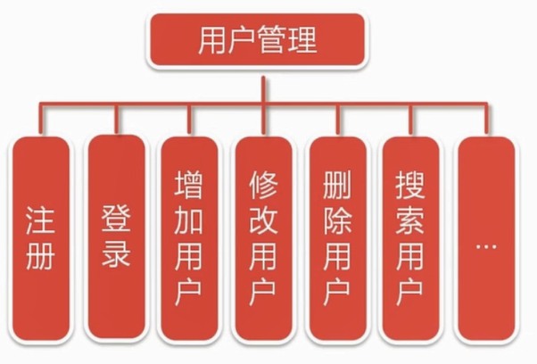

注册

- `/register`：[GET] 获取注册页面

- `/register`：[POST] 注册成功，跳转登陆页面
    - User 用户对象

登陆:

- `/login`: [get] 获取登陆页面

- `/login`: [post] 登陆
    - username
    - password
    - remember-me 是否记住我

用户管理

- `/users`: [get] 用户列表
    - async
    - pageIndex
    - pageSize
    - name 用户名称关键字

- `/users/add`: [get] 获取添加用户页面

- `/users/add`: [post] 保存添加的用户
    - User
    - authorityId 角色ID

- `/users/{id}`: [delete] 删除用户
    - id

- `/users/edit/{id}`: [get] 获取某个具体用户编辑页面
    - id

**流程图**

首页用户注册：

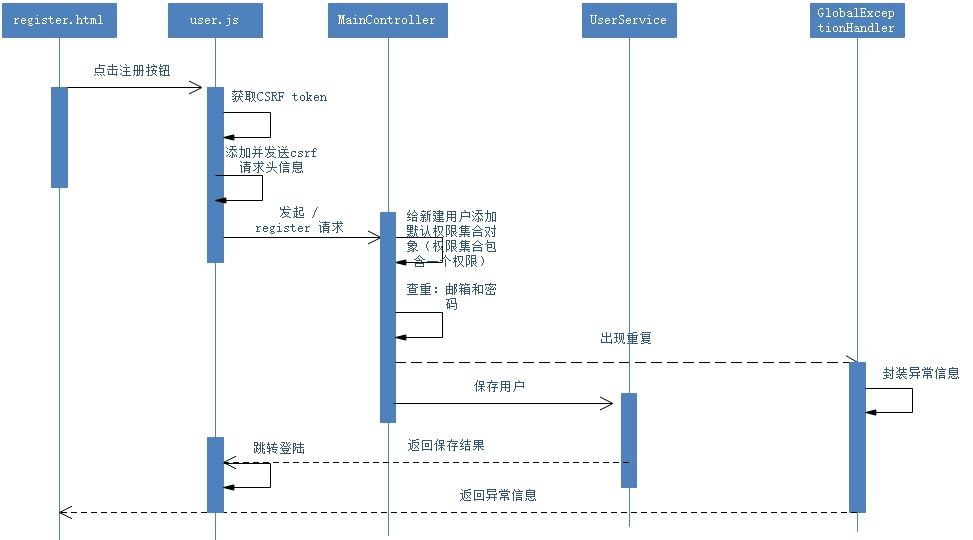

后台管理-修改用户：

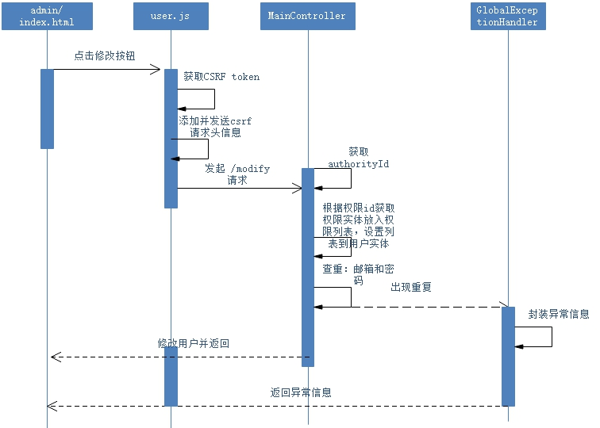


**后台实现**

1. 原有基础上添加依赖：

        // 添加  Apache Commons Lang 依赖
        compile('org.apache.commons:commons-lang3:3.5')

2. 对 User 实体添加持久化和校验注解：

```java
@Data
@Entity
public class User implements Serializable {
    @Id
    @GeneratedValue(strategy = GenerationType.IDENTITY)
    private long id;

    @NotEmpty(message = "姓名不能为空")
    @Size(min=2, max=20)
    @Column(nullable = false, length = 20) // 映射为字段，值不能为空
    private String name;

    @NotEmpty(message = "邮箱不能为空")
    @Size(max=50)
    @Email(message= "邮箱格式不对" )
    @Column(nullable = false, length = 50, unique = true)
    private String email;

    @NotEmpty(message = "账号不能为空")
    @Size(min=3, max=20)
    @Column(nullable = false, length = 20, unique = true)
    private String username; // 用户账号，用户登录时的唯一标识

    @NotEmpty(message = "密码不能为空")
    @Size(max=100)
    @Column(length = 100)
    private String password; // 登录时密码

    @Column(length = 200)
    private String avatar; // 头像图片地址

    private int age;

    protected User() {
    }
}
```

3. 实现 JpaRepository 接口，根据规范的方法名执行查询：

```java
public interface UserRepository extends JpaRepository<User, Long> {

    /**
     * 根据用户名分页查询列表
     *
     * @param name
     * @param pageable
     * @return
     */
    Page<User> findByNameLike(String name, Pageable pageable);

    /**
     * 根据用户账号查询用户
     *
     * @param username
     * @return
     */
    User findByUsername(String username);

    /**
    * 查找用户名是否被占用
    */
    boolean existsByUsername(String primaryKey);

    /**
     * 查找邮箱是否被占用
     */
    boolean existsByEmail(String primaryKey);

}
```
4. UserService 接口及实现

5. xyz.yuzh.spring.boot.blog.vo.Response 全局响应结果对象

6. AdminController 后台管理控制器 —— 跳转后台管理页面

7. UserController 后台管理用户管理控制器 —— 增删改查

8. UserOperationExcption 用户操作异常类

9. GlobalExceptionHandler 全局异常处理类

**前台实现**

1. login.html

2. register.html

3. /users/*.html

4. /admins/*.html

5. js/admins/*.js

6. js/users/*.js

**问题解决**

[如何给通过脚本添加的元素注册事件](https://github.com/yuzh233/spring-boot-blog/blob/master/blog-user/%E5%A6%82%E4%BD%95%E7%BB%99%E9%80%9A%E8%BF%87%E8%84%9A%E6%9C%AC%E6%B7%BB%E5%8A%A0%E7%9A%84%20%E5%85%83%E7%B4%A0%E6%B3%A8%E5%86%8C%E4%BA%8B%E4%BB%B6.md)

[解决使用 bootstrap 更新操作时 —— 模态框回显传值问题](https://github.com/yuzh233/spring-boot-blog/blob/master/blog-user/%E8%A7%A3%E5%86%B3%E4%BD%BF%E7%94%A8%20bootstrap%20%E6%9B%B4%E6%96%B0%E6%93%8D%E4%BD%9C%E6%97%B6%20%E2%80%94%E2%80%94%20%E6%A8%A1%E6%80%81%E6%A1%86%E5%9B%9E%E6%98%BE%E4%BC%A0%E5%80%BC%E9%97%AE%E9%A2%98.md)

## 八、角色权限管理

**需求分析**


- User 对象实现 UserDetails 接口
  
  - 实现 getAuthorities 方法，返回权限实体集合（需要自定义的 Authority 转为 SimpleGrantedAuthority）

- UserServiceImpl 实现 UserDetailsService

  - 实现 security 默认方法 loadUserByUsername，返回数据库查到的用户实体

- SecurityConfig
 
```java
@EnableWebSecurity
@EnableGlobalMethodSecurity(prePostEnabled = true)
public class SecurityConfig extends WebSecurityConfigurerAdapter {

    private static final String KEY = "yuzh.xyz";

    @Autowired
    private UserDetailsService userDetailsService;

    @Bean
    public AuthenticationProvider authenticationProvider() {
        DaoAuthenticationProvider authenticationProvider = new DaoAuthenticationProvider();
        authenticationProvider.setUserDetailsService(userDetailsService);
        return authenticationProvider;
    }


    @Override
    protected void configure(HttpSecurity http) throws Exception {
        http
                .authorizeRequests()
                    .antMatchers("/css/**", "/js/**", "/fonts/**", "/", "/index").permitAll()
                    .antMatchers("/h2-console/**").permitAll()
                    // 数据库中的字段因该是 ROLE_ADMIN ，这里不需要写 ROLE_ 前缀。
                    .antMatchers(" /admins/**").hasRole("ADMIN")
                    .and()
                .formLogin()
                    .loginPage("/login")
                    .failureUrl("/login-error")
                    .and()
                .rememberMe().key(KEY)
                    .and()
                .exceptionHandling().accessDeniedPage("/403");


        http.csrf().ignoringAntMatchers("/h2-console/**");
        http.headers().frameOptions().sameOrigin();
    }

    @Autowired
    public void configureGlobal(AuthenticationManagerBuilder auth) throws Exception {
        auth.userDetailsService(userDetailsService);
        auth.authenticationProvider(authenticationProvider());
    }
}
```

- 数据库的权限存入的格式例如 `ROLE_ADMIN` / `ROLE_USER`

- 给需要授权才能访问的方法授权

  - 给类授权：`@PreAuthorize("hasAuthority('ROLE_ADMIN')")  // 指定角色权限才能操作方法`

  - 给方法授权：如当请求参数中的 username 被查询到已认证才允许进入方法
  
  ```java
    @PostMapping("/{username}/blogs/edit")
    @PreAuthorize("authentication.name.equals(#username)")
  ```

当表单发起 `/login` 的 post 请求并携带固定名称的 `username、password` 参数，security 会自动处理登陆，若登陆失败，跳到配置好的登陆失败页面。


## 九、博客管理

**需求分析**

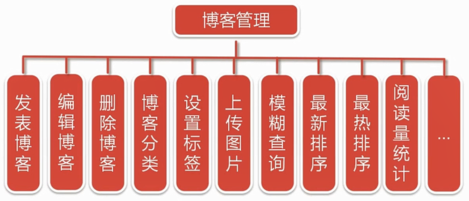

- 用户主页实现

- 个人资料设置

- 个人头像更换

**user space API：用户主页空间接口**

- `/blogs`: [get]
    - order：排序类型，new/hot，默认是 new
    - keyword：搜索关键字。博客的标签，即为关键字。
    - async：是否为异步请求页面
    - pageIndex
    - pageSize
    
- `/u/{username}`: [get] 具体某个用户的主页
    - username 用户账号

- `/u/{username}/profile`: [get] 获取个人设置页面
    - username 用户账号

- `/u/{username}/profile`: [post] 保存个人设置页面
    - username 用户账号
    - User 待保存的对象

 - `/u/{username}/avatar`: [get] 获取个人头像
    - username 用户账号

- `/u/{username}/avatar`: [post] 保存个人头像
    - username 用户账号

- `/u/{username}/blogs`: [get] 查询用户博客
    - order：排序类型，new/hot，默认是 new
    - catalog：博客分类 ID，默认为空
    - keyword：搜索关键字。博客的标签，即为关键字。
    - async：是否为异步请求页面
    - pageIndex
    - pageSize

- `/u/{username}/blogs/edits`: [get] 获取新增博客页面
    - username 用户账号

- `/u/{username}/blogs/edit/{id}`: [get] 获取编辑博客的页面
    - username 用户账号
    - id 博客ID

- `/u/{username}/blogs/edit`: [post] 保存博客
    - username 用户账号
    - Blog 待保存的博客对象

- `/u/{username}/blogs/delete/{id}`: [delete] 删除博客
    - username 用户账号
    - id 博客ID

- `/u/{username}/blogs/{id}`: [get] 获取博客展示页面
    - username 用户账号
    - id 博客ID
    

**后台实现**

添加 markdown 解析器的依赖：

```gradle
compile('es.nitaur.markdown:txtmark:0.16')
```

**MongoDB File Server 文件服务器** 

    https://github.com/waylau/mongodb-file-server

**用户个人设置**

## 十、评论管理

**需求分析**

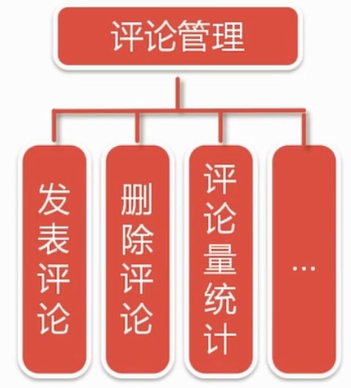

**comments API：评论管理接口**

- `/comments`: [get] 获取评论列表
    - blogid 博客id

- `/comments`: [post] 保存评论
    - blogid 博客id
      commentContent 评论内容

- `/comments/{id}`: [delete] 删除评论
    - blogid 博客id
    - id 评论id


## 十一、点赞管理

**需求分析**

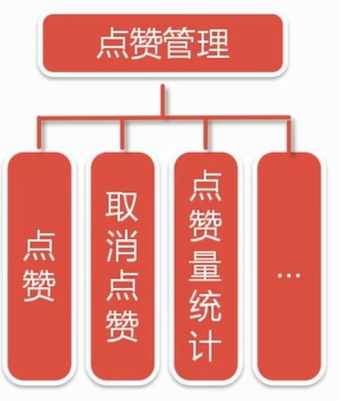

**votes API：点赞管理接口**

- `/votes`: [post] 保存点赞
    - blogid 博客id

- `/votes/{id}`: [delete] 删除点赞 
    - blogid 博客id
    - id 点赞id


## 十二、分类管理

**需求分析**

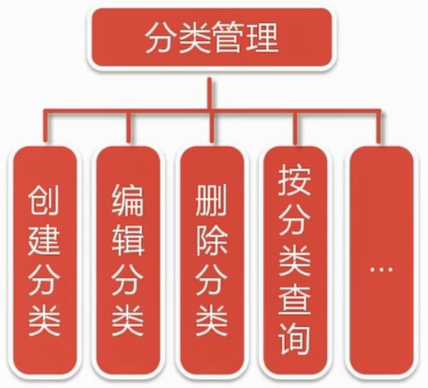

**catalogs API：分类管理接口**

- `/catalogs`: [get] 获取用户博客的分类列表
    - username 用户账号

- `/catalogs`: [post] 保存用户博客的分类
    - username 用户账号
    - CatalogVO 包含 username、Catalog

- `/catalogs/edit`: [get] 获取编辑分类界面

- `/catalogs/edit/{id}`: [get] 获取某ID分类编辑的分类界面

- `/catalogs/{id}`: [delete] 删除分类
    - id 分类ID
    - username 用户账号

## 十三、标签管理

**需求分析**

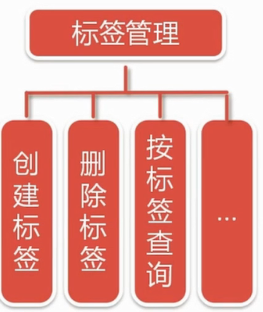

使用插件：Jquery Tags Input 1.3.6

http://xoxco.com/projects/code/tagsinput


## 十四、首页搜索

**需求分析**

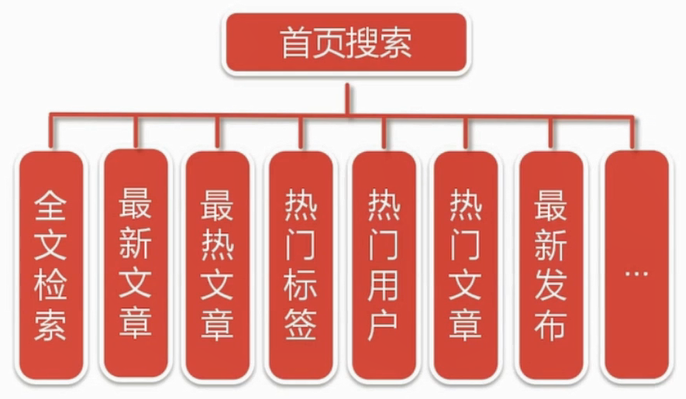

**index API：包含最新、最热文章、最热标签、最热用户等**

- `/blogs`: [get]
    - order：排序类型，new/hot
    - keyword：搜索关键字（包含博客标签）
    - async：是否异步
    - pageIndex
    - pageSize


环境：

- Elastic Search 2.4.4

- Spring Data Elastic Search 2.1.4.RELEASE -- Spring Boot 对 ES 的支持模块

- JNA 4.3.0 -- ES 依赖模块

## 十五、部署相关

### 15.1 使用外部 MongoDB 存储文件服务器数据

之前使用的是文件服务器内嵌的 mongoDB，项目停止之后图片数据不会保存。更换外部 mongoDB：

**window 下**
1. 下载 mongoDB https://www.mongodb.com/download-center#community

2. 选择 msi 文件下载安装

3. MongoDB将数据目录存储在 db 目录下。但是这个数据目录不会主动创建，需要手动创建。（如：d:/mongoData/db）

4.  **修改文件服务器 build.gradle 文件，取消使用内嵌 mongoDB**

    ```shell
	// 添加  Embedded MongoDB 的依赖用于测试
	// compile('de.flapdoodle.embed:de.flapdoodle.embed.mongo')
    ```
5. **修改文件服务器 application.yml 文件，连接独立的 MongoDB**

    ```yml
    # independent MongoDB server
    spring.data.mongodb.uri=mongodb://localhost:27017/test
    ```

6. 从 MongoDB 目录的 bin 目录中执行 mongod.exe 文件

    ```shell
        如：C:\mongodb\bin\mongod --dbpath d:\mongoData\db
    ```

7. 运行 mongo.exe 命令即可连接 MongoDB

6. 更多细节见：http://www.runoob.com/mongodb/mongodb-window-install.html


**linux 下**

```shell
curl -O https://fastdl.mongodb.org/linux/mongodb-linux-x86_64-3.0.6.tgz   # 下载
tar -zxvf mongodb-linux-x86_64-3.0.6.tgz                                  # 解压
mv mongodb-linux-x86_64-3.0.6.tgz mongodb                                 # 重命名

vim /etc/profile                                                          # 配置环境变量
---------------------
export PATH=/opt/mongodb/bin:${PATH}
---------------------
resource /etc/profile                                                     # 刷新环境变量

cd /opt/mongodb
mkdir data & cd data & mkdir db                                           # 创建文件存放目录

mongod --dbpath=/opt/mongodb/data/db                                      # 启动 mongodb
```

### 15.2 应用启动

**后台运行**：`nohup cmd &`

1. 启动 mongoDB

2. 启动文件服务器（gradlew bootRun）

3. 进入 elastic search，删除 data 文件（测试环境下），执行 `./elasticsearch`

4. 启动 blog-full （gradlew bootRun）